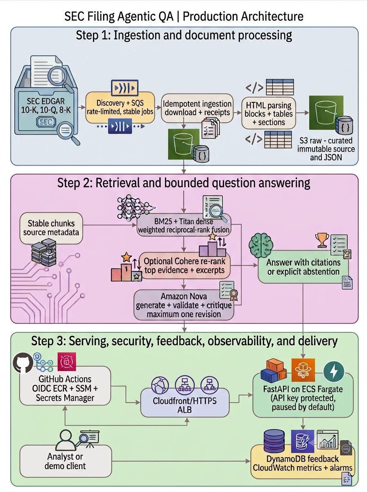

# SEC Filing Agentic QA

Grounded question answering over real SEC filings, deployed as a secured, cost-controlled AWS service. Ask a question about a 10-K, 10-Q, or 8-K; get an answer backed by verifiable citations, or an explicit abstention when the evidence is insufficient.

**Python | FastAPI | AWS (ECS Fargate, Titan, Nova) | Terraform | GitHub Actions | Release v1.0.1**

[Source code](https://github.com/Iblouse/SEC-Filling-Agentic-QA) | [v1.0.1 release](https://github.com/Iblouse/SEC-Filling-Agentic-QA/releases/tag/v1.0.1) | [v1.0.0 production release](https://github.com/Iblouse/SEC-Filling-Agentic-QA/releases/tag/v1.0.0)

---

## Results first

- Hybrid retrieval (BM25 plus dense embeddings with weighted rank fusion) reached **Recall@5 of 0.511** on a labeled 18-question benchmark, a 12% relative improvement over BM25 alone
- **93.3% citation-validity rate**: generated citations are checked against the retrieved evidence set before a response is accepted
- **33.3% abstention rate** by design: the system declines to answer rather than produce unsupported claims about financial and risk information
- Cohere reranking **reduced** aggregate benchmark performance, so it ships as an evaluated optional component, not a default. Negative results are documented, not hidden
- Runs as a protected FastAPI service on ECS Fargate behind CloudFront, deployed via Terraform and GitHub Actions OIDC, with automatic scale-to-zero for cost control

Built end to end as an independent project: ingestion, parsing, retrieval, evaluation, grounded generation, serving, security, observability, CI/CD, and release management.

---

## The problem

SEC filings hold decision-relevant detail on financial performance, risk, cybersecurity, regulation, and liquidity. But the documents are long, their HTML varies by issuer, and keyword search does not produce concise answers with verifiable evidence.

Four requirements drove the design:

1. Find relevant passages across real filings
2. Generate answers only from retrieved evidence
3. Preserve source identity and citation traceability
4. Operate as a secure, testable, cost-aware cloud service

Target workflows: investment research, credit analysis, enterprise risk, compliance, and due diligence.

---

## Architecture

Source preservation, retrieval, model reasoning, serving, and operations are separated so each stage is measurable, replaceable, and auditable.

---

## Measured results

### Retrieval benchmark

18 labeled questions across JPMorgan Chase and Bank of America filings.

| Retrieval approach | Recall@5 | Recall@10 | MRR | nDCG@10 |
|---|---:|---:|---:|---:|
| BM25 | 0.456 | 0.515 | 0.583 | 0.521 |
| Amazon Titan dense retrieval | 0.492 | 0.571 | **0.667** | 0.608 |
| Weighted hybrid rank fusion | **0.511** | **0.585** | 0.639 | **0.608** |
| Hybrid plus Cohere reranking | 0.489 | 0.567 | 0.611 | 0.570 |

Hybrid retrieval surfaced the largest share of relevant evidence in top results; dense retrieval ranked the first relevant result highest on average. Reranking underperformed on this benchmark, which is why it remained optional. Components earn their place through evaluation, not popularity.

### Grounded answer evaluation

On the evaluated question set (15 of the 18 benchmark questions):

- 93.3% citation-validity rate
- 60.0% gold-evidence hit rate
- 33.3% abstention rate
- 20.0% revision rate in the bounded critique workflow

The critique stage adds a traceable review step but did not improve every aggregate evidence metric. It is therefore bounded (accept or one revision, never a loop) and treated as a safety mechanism rather than an assumed quality gain.

---

## Engineering decisions

1. **Hybrid retrieval over a single method.** Lexical retrieval captures exact financial and regulatory terminology; dense retrieval captures semantics. Each was evaluated independently before fusion.
2. **Evidence-bounded generation.** The model receives a fixed evidence set, and citation identifiers are validated against it before a response is accepted.
3. **Bounded agent behavior.** The critic can accept or request exactly one revision. It cannot loop, call tools repeatedly, or modify state.
4. **Explicit abstention.** The API returns insufficient evidence rather than forcing an answer.
5. **Evaluation-driven component selection.** Reranking and critique stay optional because the benchmark did not show consistent improvement.
6. **Scale-to-zero deployment.** Full production controls without paying for idle Fargate tasks.

---

## Production engineering

**Reliability and reproducibility.** Deterministic ingestion jobs, idempotent workers, immutable raw and curated S3 layers, stable source/section/chunk identifiers, runtime manifest checks, and a release gate that blocks publication when CI, deployment, security, or ECS state checks fail.

**Security.** API keys in Secrets Manager, short-lived credentials via GitHub Actions OIDC with repository- and environment-scoped IAM trust, least-privilege permissions, CloudFront-restricted origin access, and secrets excluded from Git.

**Deployment.** Immutable ECR images, per-deployment ECS task-definition revisions, protected smoke tests covering readiness, authorization, grounded answers, citations, and feedback, with the accepted image tag recorded in SSM Parameter Store.

**Observability and feedback.** Structured logs, embedded CloudWatch metrics, alarms on latency, server errors, abstention, and unhealthy targets, plus DynamoDB feedback records with TTL, all joined by request identifiers.

**Cost control.** Desired task count defaults to zero. Deployment starts one task for validation, then the service automatically returns to zero.

**Repeatable demonstration.** Purpose-named scripts (`resume_api.sh`, `smoke_test_api.sh`, `demo.sh`, `pause_api.sh`) run the deployed service against the live evaluation catalog, support custom questions with issuer and filing filters, save full JSON responses as an offline fallback, and return the service to zero tasks afterward. The demo exercises the evaluated system, not a curated script.

---

## Hard problems solved

- **Inconsistent SEC HTML.** Filing-aware parsing with stable identifiers and diagnostics to handle structural variation across issuers while preserving traceability.
- **Terraform and ECS drift.** Reconciled infrastructure state after the live service diverged from Terraform outputs.
- **Secure GitHub-to-AWS delivery.** Corrected OIDC trust claims, including repository and environment identity constraints, and scoped CI/CD permissions to only what the workflow uses.
- **Immutable container delivery.** Resolved ECR tag collisions by generating unique tags from commit, workflow run, and attempt identifiers.
- **Release reliability.** A protected release gate blocked v1.0.0 until quality, Terraform, CI, deployment, security, and cost-state checks all passed.

These are documented because production engineering means diagnosing imperfect systems, not just presenting the success path.

---

## Scope and limitations

- Production support currently covers JPMorgan Chase and Bank of America filings
- The retrieval benchmark contains 18 questions; grounded QA and critique evaluations cover 15 of them
- Results are specific to the current issuers, filings, labels, and retrieval configuration
- The service is paused by default and activated for controlled demonstrations
- End-to-end TLS from CloudFront to origin would require a custom domain and ACM certificate

Documented so that performance claims stay verifiable and appropriately scoped.

---

## Roadmap

- Expand the evaluation set across more issuers, years, and filing structures
- Cross-filing and year-over-year comparison
- Improved table extraction and financial-value grounding
- Custom-domain end-to-end TLS and a public web demo with controlled usage
- Feedback-prioritized labeling, without training on unreviewed feedback

---

## Technology stack

| Area | Technologies |
|---|---|
| Language and API | Python, FastAPI, Pydantic, Uvicorn |
| Ingestion | SEC EDGAR, HTTPX, Amazon SQS, Amazon S3 |
| Retrieval | HTML parsing, BM25, Amazon Titan embeddings, weighted reciprocal-rank fusion |
| Generation | Amazon Nova, Cohere reranking, citation validation, bounded critique |
| Cloud | ECS Fargate, ECR, CloudFront, Application Load Balancer, Secrets Manager |
| Observability | DynamoDB, CloudWatch Logs, embedded metrics, dashboards, alarms |
| Delivery | Terraform, Docker, GitHub Actions, AWS OIDC, SSM Parameter Store |
| Quality | Ruff, mypy, pytest, coverage, immutable releases |

Relevant to AI Engineer, Machine Learning Engineer, Applied AI, MLOps, and Data Science roles in financial services and beyond.
