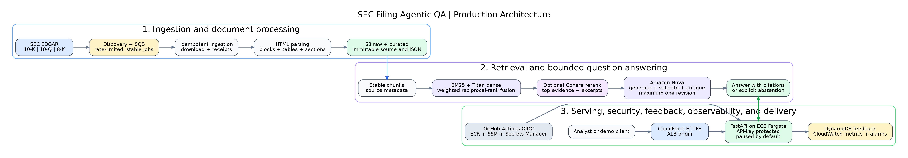

# SEC Filing Agentic QA

## Production AI search and grounded question answering over real SEC filings

**Independent end-to-end AI/ML engineering project | AWS | Python | FastAPI | Terraform | GitHub Actions | Release v1.0.0**

SEC Filing Agentic QA turns long, difficult-to-navigate 10-K, 10-Q, and 8-K filings into a searchable evidence system. A user can ask a question, receive an answer grounded in retrieved filing passages, inspect the supporting citations, or receive an explicit abstention when the evidence is insufficient.

I built the project to demonstrate more than a retrieval-augmented generation demo. It includes real-data ingestion, reproducible evaluation, secure cloud deployment, observability, user feedback, CI/CD, infrastructure as code, and cost controls.

[View the source code](https://github.com/Iblouse/SEC-Filling-Agentic-QA) · [View the v1.0.0 release](https://github.com/Iblouse/SEC-Filling-Agentic-QA/releases/tag/v1.0.0)

---

## Project highlights

| Area | Implementation and evidence |
|---|---|
| **Business-relevant problem** | Makes lengthy public-company filings easier to search while preserving traceable evidence for risk, research, compliance, and due-diligence workflows |
| **End-to-end ownership** | Designed and implemented ingestion, parsing, retrieval, evaluation, grounded generation, API serving, AWS infrastructure, security, observability, CI/CD, and release management |
| **Real production data** | Uses public SEC EDGAR 10-K, 10-Q, and 8-K filings rather than synthetic documents |
| **Measured ML performance** | Benchmarked BM25, Amazon Titan dense retrieval, hybrid rank fusion, and Cohere reranking on a labeled 18-question evaluation set |
| **Responsible AI behavior** | Validates citations, constrains generation to supplied evidence, supports explicit abstention, and limits the critique workflow to one revision |
| **Production engineering** | Runs as a protected FastAPI service on ECS Fargate behind CloudFront and an Application Load Balancer |
| **Secure delivery** | Uses Secrets Manager, least-privilege IAM, GitHub Actions OIDC, immutable ECR images, protected smoke tests, and Terraform |
| **Operational judgment** | Captures feedback and metrics, records the accepted production image, and automatically returns Fargate to zero tasks for cost control |
| **Evaluation discipline** | Retains components only when evidence supports their value and documents when reranking or critique does not improve aggregate metrics |

---

## The problem

SEC filings contain valuable information about financial performance, business risks, cybersecurity, regulation, liquidity, and management decisions. However, the documents are long, their HTML structure varies by issuer, and keyword search alone does not reliably produce a concise answer with verifiable evidence.

The project addresses four practical requirements:

1. **Find relevant passages across real filings.**
2. **Generate answers only from the retrieved evidence.**
3. **Preserve source identity and citation traceability.**
4. **Operate as a secure, testable, and cost-aware cloud service.**

Potential applications include investment research, credit analysis, enterprise risk, regulatory review, compliance, and financial due diligence.

---

## What I built

I designed and delivered the system as an independent portfolio project across a 15-stage production build:

- Controlled SEC EDGAR discovery and ingestion
- Deterministic SQS jobs and idempotent workers
- Immutable raw and curated S3 storage
- Filing-aware HTML parsing with stable block, section, and chunk identifiers
- BM25 lexical retrieval
- Amazon Titan dense embeddings and semantic retrieval
- Weighted reciprocal-rank fusion for hybrid retrieval
- Optional Cohere reranking
- Evidence-bounded answer generation with Amazon Nova
- Citation validation, abstention, critique, and a maximum of one revision
- FastAPI serving on ECS Fargate
- CloudFront HTTPS and Application Load Balancer routing
- Secrets Manager API-key protection
- DynamoDB feedback storage with TTL
- CloudWatch logs, metrics, dashboards, and alarms
- Terraform infrastructure and GitHub Actions CI/CD through AWS OIDC
- Immutable ECR images, protected deployment smoke tests, and automatic scale-down
- Versioned production release with an operational release gate

---

## Architecture



### End-to-end flow

```text
SEC EDGAR
  -> discovery manifests and deterministic SQS jobs
  -> idempotent filing download and immutable S3 storage
  -> HTML parsing into stable sections, tables, and chunks
  -> BM25 plus Amazon Titan dense retrieval
  -> weighted reciprocal-rank fusion
  -> optional Cohere reranking
  -> Amazon Nova grounded answer generation
  -> citation validation
  -> bounded critique and zero or one revision
  -> final answer with citations or explicit abstention
  -> protected FastAPI service on AWS
  -> feedback, metrics, alarms, and release-state tracking
```

The architecture separates source preservation, retrieval, model reasoning, serving, and operations. This makes individual stages measurable, replaceable, and auditable.

---

## Measured results

### Retrieval benchmark

The active benchmark contains **18 labeled questions** across JPMorgan Chase and Bank of America filings.

| Retrieval approach | Recall@5 | Recall@10 | MRR | nDCG@10 |
|---|---:|---:|---:|---:|
| BM25 | 0.456 | 0.515 | 0.583 | 0.521 |
| Amazon Titan dense retrieval | 0.492 | 0.571 | **0.667** | 0.608 |
| Weighted hybrid rank fusion | **0.511** | **0.585** | 0.639 | **0.608** |
| Hybrid plus Cohere reranking | 0.489 | 0.567 | 0.611 | 0.570 |

**Interpretation:** Hybrid retrieval found the largest share of relevant evidence in the top results, while dense retrieval ranked the first relevant result highest on average. Cohere reranking reduced aggregate performance on this benchmark, so I kept it as an evaluated optional component rather than assuming it improved the system.

### Grounded answer evaluation

The evaluated question-answering set produced:

- **93.3% citation-validity rate**
- **60.0% gold-evidence hit rate**
- **33.3% abstention rate**
- **20.0% revision rate** in the bounded critique workflow

The abstention behavior is intentional. For a system used around financial and risk information, declining to answer without adequate evidence is preferable to producing an unsupported response.

The critique stage added a traceable review step but did not improve every aggregate evidence metric. This result informed the final design: the workflow is bounded, measurable, and treated as a safety mechanism rather than an automatic quality improvement.

---

## Production and MLOps evidence

This project demonstrates the work required to move from a notebook experiment to a controlled service:

### Reliability and reproducibility

- Deterministic ingestion jobs and idempotent processing
- Immutable raw and curated source layers
- Stable source, section, and chunk identifiers
- Runtime manifest and artifact consistency checks
- Automated linting, formatting, type checking, tests, Terraform validation, and container builds
- A release gate that blocks publication when CI, deployment, security, or ECS state checks fail

### Security

- Protected answer and feedback endpoints
- API key stored in AWS Secrets Manager
- Short-lived AWS credentials through GitHub Actions OIDC
- Repository-and-environment-scoped IAM trust
- Least-privilege permissions for ECR, ECS, CloudFront, SSM, and smoke-test operations
- CloudFront-restricted origin access
- Credentials, Terraform state, local data, and virtual environments excluded from Git

### Deployment

- Immutable container images in Amazon ECR
- ECS task-definition revisions for each deployment
- Automated readiness, authorization, answer, citation, and feedback smoke tests
- Successfully tested image tag recorded in AWS Systems Manager Parameter Store
- Published GitHub release: **v1.0.0**

### Observability and feedback

- Structured application logs
- Embedded CloudWatch metrics
- Latency, server-error, abstention, and unhealthy-target alarms
- DynamoDB feedback records with automatic TTL expiration
- Request identifiers connecting answers, feedback, and operational evidence

### Cost controls

- ECS desired count defaults to zero
- Deployment temporarily starts one task for validation
- The service automatically returns to zero tasks after testing
- Infrastructure costs and retained-resource trade-offs are documented

---

## Important engineering decisions

### 1. Hybrid retrieval instead of relying on one retrieval method

Lexical retrieval captures exact financial and regulatory terminology. Dense retrieval captures semantic similarity. I evaluated each approach independently before combining them with weighted reciprocal-rank fusion.

### 2. Evidence-bounded generation instead of open-ended model answering

The language model receives a fixed evidence set. Citation identifiers are checked against that set before the response is accepted.

### 3. Bounded agent behavior instead of an uncontrolled loop

The critic can accept an answer or request one revision. It cannot repeatedly call tools, change infrastructure, modify indexes, or continue indefinitely.

### 4. Explicit abstention instead of forced answers

The API can return insufficient evidence when retrieval or citation checks do not support a reliable response.

### 5. Evaluation-driven component selection

Cohere reranking and the critique workflow remained measurable and optional because the benchmark did not show consistent aggregate improvement.

### 6. Scale-to-zero deployment for a portfolio workload

The architecture demonstrates production controls without running Fargate continuously when the service is not being demonstrated.

---

## Difficult problems I solved

This project required more than connecting an LLM to a vector store.

- **Inconsistent SEC HTML:** Built filing-aware parsing, stable identifiers, and diagnostics to handle variation across issuer documents while preserving traceability.
- **Terraform and ECS drift:** Reconciled infrastructure state after a service no longer matched Terraform outputs.
- **Secure GitHub-to-AWS deployment:** Corrected OIDC trust claims, including repository and environment identity constraints.
- **Immutable container delivery:** Resolved ECR tag collisions by generating unique tags from commit, workflow run, and attempt identifiers.
- **Least-privilege CI/CD:** Added only the CloudFront and SSM permissions required by the deployment workflow.
- **Release reliability:** Added protected smoke tests and a release gate that prevented `v1.0.0` publication until local quality, Terraform, CI, deployment, security, and cost-state checks passed.

These troubleshooting steps are documented because production engineering includes diagnosing imperfect systems, not only presenting the final success path.

---

## Technology stack

| Area | Technologies |
|---|---|
| Language and API | Python, FastAPI, Pydantic, Uvicorn |
| Data ingestion | SEC EDGAR, HTTPX, Amazon SQS, Amazon S3 |
| Parsing and retrieval | HTML parsing, BM25, Amazon Titan embeddings, weighted reciprocal-rank fusion |
| Generative AI | Amazon Nova, Cohere reranking, citation validation, bounded critique |
| Cloud platform | AWS ECS Fargate, ECR, CloudFront, Application Load Balancer, Secrets Manager |
| Feedback and observability | DynamoDB, CloudWatch Logs, embedded metrics, dashboards, alarms |
| Infrastructure and delivery | Terraform, Docker, GitHub Actions, AWS OIDC, SSM Parameter Store |
| Engineering quality | Ruff, mypy, pytest, coverage, immutable releases |

---

## Experience demonstrated

- I can translate an ambiguous AI idea into an end-to-end architecture.
- I evaluate retrieval and generation components instead of selecting them by popularity.
- I build with real data and preserve traceability.
- I treat security, deployment, monitoring, feedback, and cost as part of the product.
- I document limitations and negative results clearly.
- I can troubleshoot cloud, IAM, CI/CD, container, and application failures systematically.
- I can communicate the same system at business, architecture, and implementation levels.

This project is directly relevant to **AI Engineer, Machine Learning Engineer, Data Scientist, Applied AI, MLOps, and Data Engineering** roles.

---

## Current scope and limitations

- Production support currently covers JPMorgan Chase and Bank of America.
- The retrieval benchmark contains 18 questions; the latest grounded QA and critique evaluations cover 15 of them.
- Benchmark results are specific to the current issuers, filings, labels, and retrieval configuration.
- The service is paused by default and is activated for controlled demonstrations.
- End-to-end TLS from CloudFront to the origin would require a custom domain and ACM certificate.

These limitations are documented so that performance claims remain verifiable and appropriately scoped.

---

## Next extensions

- Expand the evaluation set across more issuers, years, and filing structures
- Add cross-filing and year-over-year comparison
- Improve table extraction and financial-value grounding
- Add custom-domain end-to-end TLS
- Build a public web demonstration with controlled usage
- Use feedback signals to prioritize labeling and evaluation, without automatically training on unreviewed feedback

---

## Repository and release

- **Source:** [Iblouse/SEC-Filling-Agentic-QA](https://github.com/Iblouse/SEC-Filling-Agentic-QA)
- **Production release:** [v1.0.0](https://github.com/Iblouse/SEC-Filling-Agentic-QA/releases/tag/v1.0.0)
- **Data:** Public SEC EDGAR filings
- **Deployment posture:** Validated production architecture, paused by default for cost control

---

## Relevant areas of work

I built this project to demonstrate production-level capability for roles involving:

- Applied AI and generative AI systems
- Machine learning engineering
- Retrieval and search
- Data science and model evaluation
- MLOps and cloud deployment
- Data engineering and production pipelines
- Financial-services and risk analytics
